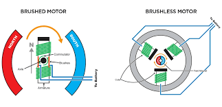
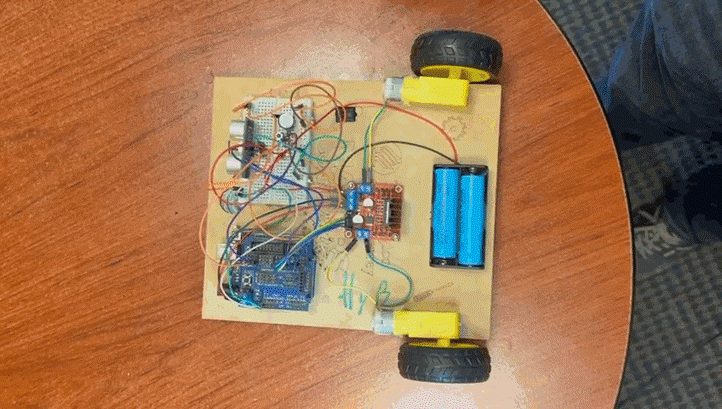

Componentes
===========

.. _installation:

Ultrasónico
------------

.. autosummary::
   :toctree: generated

El sensor ultrasónico  consta de dos elementos. Un Transmisor (``Trigger``) y un receptor (``Echo``). 

.. code-block:: c++
   
   void setup() {

   pinMode(2, INPUT);  // ECHO
   pinMode(3, OUTPUT); // TRIGGER

   Serial.begin(9600);
   }

   void loop() {
   float d = ultra();

   //Aquí declara tu if
  
   }

   float ultra() {
   int trigger = 3;                            //Pin digital 2 para el Trigger del sensor
   int echo = 2;                               //Pin digital 3 para el Echo del sensort
   float tiempo_de_espera,distancia; 
  
   digitalWrite (trigger,LOW);               // ponemos en bajo el pin 8 durante 2 microsegundos
   delayMicroseconds(2);
   digitalWrite (trigger, HIGH);             // ahora ponemos en alto pin 8 durante 10 microsegundos;
   delayMicroseconds (10);                   // pues este el momento en que emite el sonido durante 10 segungos
   digitalWrite (trigger, LOW);              // ahora ponemos en bajo pin 8 
   tiempo_de_espera = pulseIn (echo,HIGH);   // pulseIn, recoge la señal del sonido que emite el trigger
   distancia =(tiempo_de_espera/2)/29.15;    // formula para hallar la distancia
   Serial.print (distancia);                 // imprimimos la distancia en cm
   Serial.println ("cm");
   return distancia;
   }

En el código anterior es posible usar la función para usar el ultrasónico y prender un LED, un motor o cualquier otro componente todo usando un if en donde ``d`` es la distancia que regresa la función.

Actuadores
----------

.. note::
   Es una forma elegante de decir motor.  

Los motores de corriente directa (CD) son muy pequeños y a menudo requiere de una caja de reducción. (utilizados durante el curso de INgenieros JR.)

Estos motores contienen una caja de reducción ya sea de mayor o menos dependiendo del motor. Esta caja de reducción, es una caja de engranes cuya combinación hace que el motor tenga menos velocidad pero más TORQUE(**fuerza**).

Tenemos 4 entradas en el puente H.  Cada par controla a cada motor.

IN1. Motor 1 / 
IN2. Motor 1 / 
IN3. Motor 2 / 
IN4. Motor 2 

**Para programarlo:**

.. note::
   Al subir el código tu bot debe estar apagado pero al probarlo, enciéndelo para que las pilas ayuden a mover los        motores ya que el USB por si solo no entrega el voltaje necesario para moverlo.  

Para comenzar es importante primero mapear los puertos en los que conectamos cada cable del puente H al arduino de la siguiente manera:

.. code-block:: c++

   int in1 = 4;
   int in2 = 5;
   int in3 = 6;
   int in4 = 7;

El siguiente paso para programar los actuadores es configurarlos como puertos de salida en ``void Loop()`` tal y como se observa en el siguiente código:

.. code-block:: c++

   void setup(){
   pinMode (in1, OUTPUT);
   pinMode (in2, OUTPUT);
   pinMode (in3, OUTPUT);
   pinMode (in4, OUTPUT);
   }

Para poner a prueba los motores y mover el robot en línea recta es necesario declarar lo siguiente:

.. code-block:: c++

   void loop(){
   digitalWrite (in1, LOW);
   digitalWrite (in2, HIGH);
   digitalWrite (in3, HIGH);
   digitalWrite (in4, LOW);
   }

Al final debería quedar algo como lo siguiente:

.. code-block:: c++

   int in1 = 4;
   int in2 = 5;
   int in3 = 6;
   int in4 = 7;

   void setup(){
   pinMode (in1, OUTPUT);
   pinMode (in2, OUTPUT);
   pinMode (in3, OUTPUT);
   pinMode (in4, OUTPUT);
   }

   void loop(){
   digitalWrite (in1, LOW);
   digitalWrite (in2, HIGH);
   digitalWrite (in3, HIGH);
   digitalWrite (in4, LOW);
   }
   
.. note::
   Si ves que no van hacia adelante prueba cambiando la configuración. 

Este mismo código puede ser usado en una ``Función`` de tal forma que no se tenga que repetir todo si se desea usar múltiples veces, la función quedaría de la siguiente manera.

.. code-block:: c++

   int in1 = 4;
   int in2 = 5;
   int in3 = 6;
   int in4 = 7;

   void setup(){
   pinMode (in1, OUTPUT);
   pinMode (in2, OUTPUT);
   pinMode (in3, OUTPUT);
   pinMode (in4, OUTPUT);
   }

   void loop(){
   adelante();
   }

   void adelante(){
   digitalWrite (in1, LOW);
   digitalWrite (in2, HIGH);
   digitalWrite (in3, HIGH);
   digitalWrite (in4, LOW);
   }

